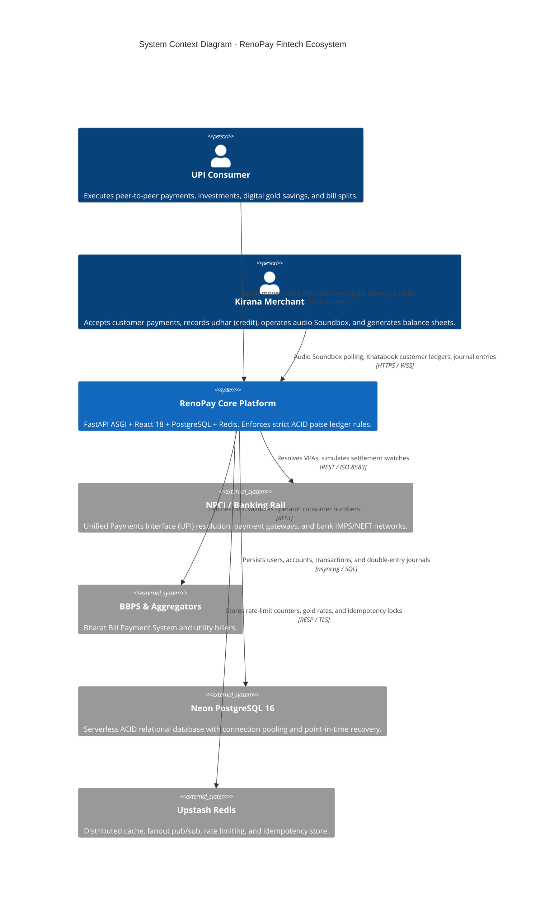
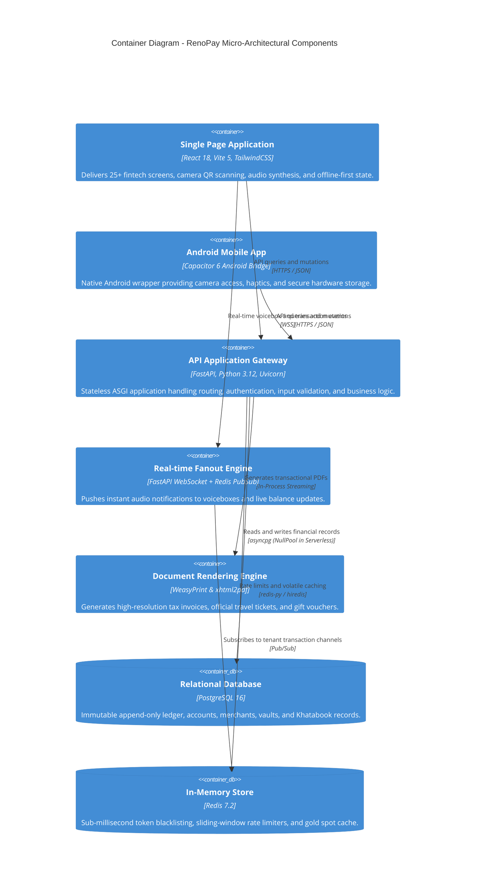
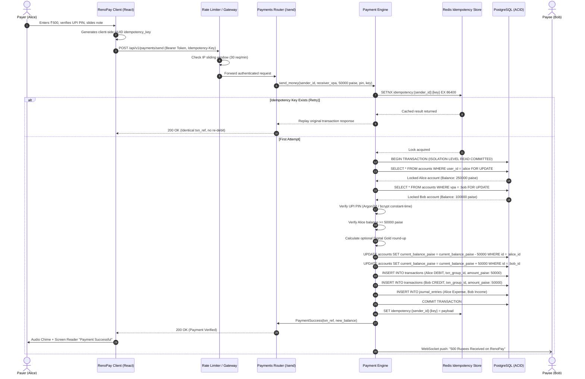

# RenoPay Architecture & Technical Specification

> **System Classification**: High-Concurrency Financial Super-App & Merchant Operating System  
> **Review Standard**: Google SRE / Amazon Well-Architected Financial Services  
> **Target Invariants**: Zero-Float Integrity, Append-Only Double-Entry Ledger, Idempotent Transaction Execution  

---

## 1. System Overview & C4 Model

### 1.1 Context Diagram (C4 Level 1)

### 1.2 Container Diagram (C4 Level 2)

---

## 2. Payment Data Flow & Sequence Diagram

The following sequence details an idempotent peer-to-peer payment execution from client gesture to immutable double-entry journal posting:

---

## 3. Core Financial Invariants (Non-Negotiable)

RenoPay enforces four fundamental rules of financial systems engineering:

### 3.1 Integer-Precision Currency (`BigInteger` Paise)
Floating-point mathematics (`IEEE 754`) exhibits catastrophic rounding errors (e.g., `0.1 + 0.2 = 0.30000000000000004`). In RenoPay:
- **Rule**: All currency values in database columns (`current_balance_paise`, `amount_paise`, `net_balance_paise`) are strictly 64-bit integers representing Indian paise (₹1 = 100 paise).
- **Rule**: Mathematical conversions occur only at the serialization perimeter using `rupees_to_paise()` and `paise_to_rupees()`.
- **Validation**: Floating points with sub-paise fractional increments are rounded half-up deterministically or rejected.

### 3.2 Append-Only Immutable Ledger
- **Rule**: Ledger tables (`transactions`, `journal_entries`, `khatabook_entries`) are strictly append-only.
- **Rule**: No financial row may be executed with SQL `UPDATE` or `DELETE` on financial amounts.
- **Rule**: Corrections, chargebacks, and refunds MUST be represented as distinct compensatory ledger rows linked to the originating `txn_group_id`.

### 3.3 Pessimistic Concurrency (`SELECT ... FOR UPDATE`)
- **Rule**: Before any debit or credit operation, the relevant account rows MUST be locked via `SELECT FOR UPDATE`.
- **Deadlock Avoidance**: When locking multiple accounts in a single transaction (sender and receiver), account IDs are always sorted lexographically before locking (`ORDER BY id ASC`).

### 3.4 Cryptographic Idempotency Keys
- **Rule**: All payment and credit mutations require a unique client-generated UUID `idempotency_key`.
- **Storage**: Keys are stored in Redis with a 24-hour TTL and verified in the database transaction table (`txn_ref` uniqueness).
- **Behavior**: Duplicate requests return identical responses without initiating secondary ledger debits.

---

## 4. Failure Modes & Circuit Breakers

| Failure Scenario | Impact | RenoPay Defensive Architecture | Recovery Path |
|------------------|--------|-------------------------------|---------------|
| **Redis Node Outage** | Cache and rate-limiting unavailable | In-memory token bucket fallback automatically activates (`FallbackMemoryLimiter`). Read requests bypass cache and query Postgres with explicit index limits. | Background healthcheck retries Redis connection; cache self-heals upon node reconnection. |
| **Postgres Connection Exhaustion** | Latency spike on DB pool | In Vercel serverless mode, `NullPool` is enforced to prevent zombie idle connections. Composite indexes ensure queries execute under 5ms, minimizing connection holding time. | Neon auto-scales compute; client timeouts trigger graceful retry with exponential backoff. |
| **Concurrent Double-Spend Attack** | Attacker executes 10 simultaneous debits on zero/low balance | `SELECT FOR UPDATE` serializes the 10 transactions. The first transaction succeeds and drains the balance; subsequent 9 transactions fail `INSUFFICIENT_FUNDS` checks. | Verified by test suite `tests/test_concurrency_payments.py`. |
| **PDF Rendering Library Failure** | WeasyPrint native C-libraries absent | Service gracefully falls back to pure-Python `xhtml2pdf` engine, ensuring tickets and receipts continue generating. | Zero crash; degraded font rendering fallback logged with warning. |
