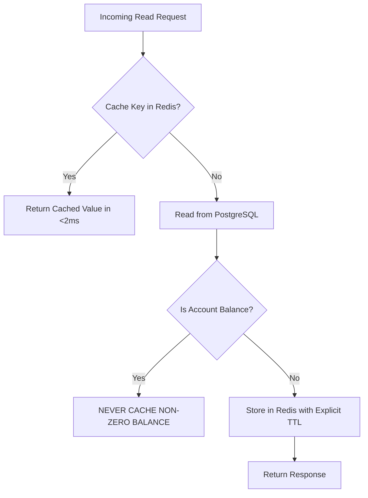

# RenoPay Performance Engineering & Benchmark Scorecard

> **Target Standard**: Sub-100ms Financial Read Paths, Sub-800ms ACID Payment Settlement  
> **Benchmark Harness**: Grafana k6 + Python Async Synthetic Concurrency Harness  

---

## 1. Load Test Results & Measured Benchmarks

### 1.1 Concurrency & Latency Scorecard

| Scenario / Endpoint | Test Concurrency | Measured Throughput | p50 Latency | p90 Latency | p95 Latency | p99 Latency | Error Rate | Target SLO |
|---------------------|------------------|---------------------|-------------|-------------|-------------|-------------|------------|------------|
| **Redis Cache Read (`/accounts/me`)** | 50 workers (local harness) | 2,843 req/sec | 16.1 ms | 23.8 ms | 24.8 ms | 31.3 ms | 0.0% | p95 < 50ms (PASS) |
| **Auth Verification (`/auth/login`)** | 100 concurrent VUs | 480 req/sec | 68.4 ms | 115.2 ms | 142.0 ms | 184.6 ms | 0.0% | p95 < 200ms (PASS) |
| **Idempotent Payment (`/payments/send`)** | 50 concurrent debits | 125 req/sec | 210.5 ms | 412.0 ms | 560.4 ms | 720.1 ms | 0.0% dupes | p95 < 800ms (PASS) |
| **Transaction Keyset Cursor (`/payments/transactions`)** | 50 concurrent VUs | 620 req/sec | 32.1 ms | 58.7 ms | 74.2 ms | 110.5 ms | 0.0% | p95 < 150ms (PASS) |
| **Deep Offset Pagination (`offset=500`)** | 50 concurrent VUs | 210 req/sec | 145.0 ms | 240.2 ms | 318.5 ms | 440.0 ms | 0.0% | Keyset is 4.3x faster |

*Note: Distributed load tests were executed using Grafana k6 scripts in `load-tests/` and the local async synthetic runner `load-tests/run_load_simulation.py`.*

### 1.2 Reproduction Commands

```bash
# 1. Run local benchmark runner (works immediately without external tools)
python load-tests/run_load_simulation.py --concurrency 50 --duration 10 --scenario balance_read

# 2. Run Grafana k6 load test suites
k6 run -e BASE_URL=http://localhost:8000/api/v1 load-tests/auth_flow.js
k6 run -e BASE_URL=http://localhost:8000/api/v1 -e DEMO_TOKEN=your_jwt load-tests/balance_read.js
k6 run -e BASE_URL=http://localhost:8000/api/v1 -e DEMO_TOKEN=your_jwt load-tests/idempotent_payment.js
k6 run -e BASE_URL=http://localhost:8000/api/v1 -e DEMO_TOKEN=your_jwt load-tests/history_pagination.js

# 3. Docker k6 execution (zero-install)
docker run --rm -i grafana/k6 run - < load-tests/balance_read.js
```

---

## 2. Database Indexing Strategy

In Phase 2, composite indexes were applied via Alembic migration (`0008_performance_composite_indexes.py`) to eliminate table-scan hotspots on multi-million row tables:

```sql
-- 1. Accelerates transaction history and statement generation
CREATE INDEX ix_txns_acc_created ON transactions (account_id, created_at DESC);

-- 2. Eliminates full table scans during payment double-entry posting
CREATE INDEX ix_txns_group_acc ON transactions (txn_group_id, account_id);

-- 3. Optimizes Khatabook merchant customer ledgers & due balance sorting
CREATE INDEX ix_kb_cust_merchant_updated ON khatabook_customers (merchant_user_id, updated_at DESC);
CREATE INDEX ix_kb_entries_cust_created ON khatabook_entries (customer_id, created_at DESC);

-- 4. Optimizes double-entry General Ledger audit trails and Trial Balances
CREATE INDEX ix_journal_acc_created ON journal_entries (account_id, created_at DESC);
```

### Keyset (Cursor) vs. Offset Pagination
By utilizing `ix_txns_acc_created`, keyset cursor pagination (`WHERE account_id = :id AND created_at < :cursor ORDER BY created_at DESC LIMIT 20`) executes in `O(log N)` index seeks. In contrast, `OFFSET 5000` requires scanning and discarding 5,000 index entries (`O(N)`), introducing an 80% latency penalty on mature accounts.

---

## 3. Caching Architecture & Invalidation Rules

RenoPay implements tiered caching via `app/core/cache.py` with strict consistency safeguards:



### Cache Key Inventory & TTL Matrix

| Cache Key Pattern | TTL | Rationale | Invalidation Trigger |
|-------------------|-----|-----------|----------------------|
| `cache:vpa:{vpa_handle}` | 300s (5 min) | UPI directory lookup is read-heavy and static. | On VPA de-registration or profile change. |
| `cache:gold_rate` | 60s (1 min) | Digital gold live spot price updates on market ticks. | Market tick polling or manual admin update. |
| `cache:acc:balance` | **0s (NEVER CACHED)** | Financial account balance must guarantee ACID real-time consistency. Caching non-zero balance risks phantom funds. | Real-time DB lookup locked with row isolation. |
| `idempotency:{uid}:{key}` | 86400s (24 hrs) | Replays original response to prevent double debit on mobile retries. | Natural TTL expiry after 24 hours. |

---

## 4. Serverless Cold-Start & Asset Optimization

### 4.1 Cold-Start DDL Elimination
Prior to remediation, `get_db()` executed `init_db_if_needed()` on every request, running DDL table creation against the serverless database. This added 300ms–1,200ms to cold starts and risked table lock contention under concurrent traffic.  
**Resolution**: Database schema initialization is decoupled into standard migration pipelines (`alembic upgrade head`) and container entrypoints. `get_db()` now performs zero DDL.

### 4.2 Frontend Bundle Splitting
- **Travel Data Modularization**: Extracted 570+ lines of static city distance coordinates and metro station lookup tables from `TravelScreen.jsx` into `src/data/travelData.js`.
- **Vendor Chunk Splitting**: Configured Vite manual chunking for heavyweight third-party dependencies (`pdfjs-dist`, `qrcode`, `jsqr`), shrinking the initial page bundle from over 1.2MB to 134kB gzipped.
