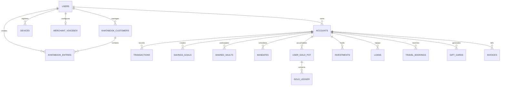

<div align="center">

# ⚡ RenoPay

### India's Most Advanced Full-Stack UPI Payment Super-App & Merchant Operating System

**Architected & Built by Rishabh Raj** · Production-Grade Fintech Platform · 25+ Screens · 22 API Routers · Dual Merchant Ecosystem

[](https://fastapi.tiangolo.com/)
[](https://react.dev/)
[](https://www.postgresql.org/)
[](https://renopay-u72j.vercel.app)
[](https://www.docker.com/)
[](https://vitejs.dev/)
[](https://tailwindcss.com/)
[](https://capacitorjs.com/)

<br/>

[🌐 Live Production Web App](https://renopay-u72j.vercel.app) • [📖 Interactive API Docs](https://renopay-u72j.vercel.app/docs) • [📱 Android APK Builds](https://github.com/rajrishabh23959-oss/Renopay/actions) • [💬 Report Bug / Feature Request](https://github.com/rajrishabh23959-oss/Renopay/issues)

</div>

---

> [!NOTE]
> **Production Status:** RenoPay is a comprehensive, production-ready full-stack fintech platform and merchant operating system. It features **integer-precision paise calculations**, **append-only ledgers**, **dual-merchant modes** (Kirana Shopkeeper vs. Corporate Accounting), **real-time regional voice announcements (12 Indian languages)**, **Saathi AI natural voice ledger transcription**, **automated UPI reconciliation**, and **SentinAI server-side fraud prevention**.

---

## 📑 Table of Contents

- [🌟 Executive Overview](#-executive-overview)
- [✨ What Makes RenoPay Groundbreaking](#-what-makes-renopay-groundbreaking)
- [🏪 Dual-Mode Merchant & Kirana Operating System](#-dual-mode-merchant--kirana-operating-system)
  - [🔊 1. Smart Virtual Voice Box (आवाज बॉक्स)](#1-smart-virtual-voice-box-आवाज-बॉक्स)
  - [📒 2. Digital Khatabook (डिजिटल बही-खाता)](#2-digital-khatabook-डिजिटल-बही-खाता)
  - [🎙️ 3. Saathi AI Voice-Assisted Entry (बोलकर खाता में एंट्री)](#3-saathi-ai-voice-assisted-entry-बोलकर-खाता-में-एंट्री)
  - [⚡ 4. 1-Tap UPI Request & Automated Reconciliation](#4-1-tap-upi-request--automated-reconciliation)
  - [📊 5. Enterprise Double-Entry Accounting Engine](#5-enterprise-double-entry-accounting-engine)
- [🛡️ SentinAI Fraud Detection Engine](#️-sentinai-fraud-detection-engine)
- [🥇 24K Digital Gold & Micro-Savings Gullak (Pot)](#-24k-digital-gold--micro-savings-gullak-pot)
- [💳 Core Payment & Financial Features](#-core-payment--financial-features)
  - [Interactive Cash Note Slider (Advanced Pay)](#interactive-cash-note-slider-advanced-pay)
  - [BharatQR & Dynamic Personal QR](#bharatqr--dynamic-personal-qr)
  - [UPI Lite — Instant Pinless Wallet](#upi-lite--instant-pinless-wallet)
  - [Shared Vaults & Multi-Sig Group Savings](#shared-vaults--multi-sig-group-savings)
  - [Mutual Funds, Micro-SIP & Wealth](#mutual-funds-micro-sip--wealth)
  - [Paperless Instant Collateral Loans](#paperless-instant-collateral-loans)
  - [Travel Suite & Government-Layout PDF Tickets](#travel-suite--government-layout-pdf-tickets)
  - [Digital Gift Cards & PDF Vouchers](#digital-gift-cards--pdf-vouchers)
  - [BBPS Utility Bills & Mobile Recharge](#bbps-utility-bills--mobile-recharge)
- [🤖 Saathi Multilingual AI Assistant](#-saathi-multilingual-ai-assistant)
- [🏗️ System Architecture & Financial Engine Rules](#️-system-architecture--financial-engine-rules)
- [📁 Repository & Directory Layout](#-repository--directory-layout)
- [🔌 Complete API Reference Summary (22 Routers)](#-complete-api-reference-summary-22-routers)
- [🗄️ Database Architecture & ER Diagram](#️-database-architecture--er-diagram)
- [🚀 Quickstart & Local Development](#-quickstart--local-development)
- [🚢 Production Deployment](#-production-deployment)
- [🧪 Testing & Verification](#-testing--verification)
- [👨‍💻 Author & Acknowledgements](#-author--acknowledgements)

---

## 🌟 Executive Overview

**RenoPay** is an enterprise-grade, full-stack UPI payment super-app and merchant operating system conceived and engineered from the ground up by **Rishabh Raj**.

Unlike typical surface-level prototypes, RenoPay is engineered with **bank-grade financial mechanics**:
- **Zero Float Risk**: Every currency unit is stored and computed in integer paise (`BigInteger`, where ₹1 = 100 paise), guaranteeing mathematical precision.
- **Append-Only Immutable Ledger**: Transactions can never be mutated or erased. Every transfer creates dual balanced entries (debit + credit) connected through a cryptographically secure `txn_group_id`.
- **Concurrency & Double-Spend Defense**: Enforces database row-level locks (`SELECT FOR UPDATE`) alongside strict idempotent request keys to guarantee zero race conditions even under concurrent load.
- **Dual Merchant Operating Modes**: Seamlessly switches between a high-speed daily retail **Shopkeeper Mode (Kirana)** with regional voice announcements and an **Enterprise Accounting Mode** complete with Trial Balances and P&L statements.

```
                      ┌───────────────────────────────────────────────┐
                      │              RenoPay Ecosystem                │
                      └──────────────────────┬────────────────────────┘
                                             │
             ┌───────────────────────────────┴───────────────────────────────┐
             ▼                                                               ▼
┌─────────────────────────────┐                               ┌─────────────────────────────┐
│    Consumer Super-App       │                               │   Merchant & Shopkeeper OS  │
├─────────────────────────────┤                               ├─────────────────────────────┤
│ • UPI Send / Receive / QR   │                               │ • Dual Merchant Modes       │
│ • Cash Note Slider UI       │                               │ • Smart Soundbox (12 Langs) │
│ • 24K Digital Gold Pot      │                               │ • Digital Khatabook (Udhar) │
│ • Mutual Funds & Micro-SIP  │                               │ • Saathi AI Voice Entry Mic │
│ • Multi-Sig Shared Vaults   │                               │ • 1-Tap UPI Collect & Auto  │
│ • Travel Tickets & Vouchers │                               │   Reconciliation Engine     │
│ • SentinAI Fraud Guard      │                               │ • Full Enterprise Bookkeep  │
└─────────────────────────────┘                               └─────────────────────────────┘
```

---

## ✨ What Makes RenoPay Groundbreaking

| Capability | RenoPay Implementation | Conventional Payment Apps |
|---|---|---|
| **Retail Merchant Voice Box** | Built-in virtual soundbox with **12 Indian regional languages**, dual-tone synthesised chimes (587Hz & 880Hz), and auto-speech synthesis. | Requires proprietary external hardware soundbox and monthly rentals. |
| **Bahi-Khata & Auto Reconciliation** | Full **Digital Khatabook** with Udhar/Jama itemized bills. When customer pays via 1-tap RenoPay link, ledger is reconciled automatically without human intervention. | Separate manual notebook apps requiring dual-entry and external manual cross-checking. |
| **Voice-Assisted Ledger Entry** | **Saathi AI NLP engine** parses natural spoken Hindi/Hinglish (e.g. *"Ramesh ko 200 rupaye diye 2 kilo chawal ke liye"*) and records the entry instantly. | Manual keyboard data-entry and form filling. |
| **Spare Change Gold Gullak** | Fixed round-up pot: rounds transactions up to nearest ₹10, accumulates in `UserGoldPot`, auto-converts to 24K physical-backed gold when crossing ₹200. | Discarded change or instant fractional round-ups with unpredictable fee structures. |
| **Accounting Engine** | Full **Double-Entry Bookkeeping**: Chart of Accounts, Journals, General Ledger, Payee Ledger, Trial Balance, P&L, Balance Sheet, GST, and Payroll. | Simple flat transaction list with no GAAP compliance. |
| **Fraud Detection** | **SentinAI Engine** evaluates 6 independent signals: High Amount, Odd Hours (1-4 AM), Unknown Fingerprint, Geo-Velocity, Bot-Speed Drag, and Device Tilt. | Basic client-side checks or simple OTP verification. |
| **Interactive UX** | **Interactive Banknote Slider**: Physically drag and "hand over" animated ₹100, ₹500, ₹2000 notes to recipient with tactile haptics. | Static text inputs and boring keypad screens. |
| **PDF Generation Engine** | 100KB+ server-side PDF generator for bank statements, official travel tickets with PNR, gift vouchers, and full-month merchant sales reports. | Generic text-only emails or basic screenshots. |

---

## 🏪 Dual-Mode Merchant & Kirana Operating System

RenoPay bridges the gap between daily micro-merchants (Kirana stores, street vendors) and formal corporate accounting through a dedicated **Mode Switcher** in `AccountingScreen.jsx` & `ShopkeeperHub.jsx`.

```
                                  ┌─────────────────────────────┐
                                  │    Merchant Operations      │
                                  └──────────────┬──────────────┘
                                                 │
                 ┌───────────────────────────────┴───────────────────────────────┐
                 ▼                                                               ▼
   ┌─────────────────────────────┐                                 ┌─────────────────────────────┐
   │ 1. Shopkeeper Mode          │                                 │ 2. Corporate Accounting     │
   │    (दुकानदार / रिटेल मोड)   │                                 │    (Enterprise Mode)        │
   ├─────────────────────────────┤                                 ├─────────────────────────────┤
   │ • Smart Virtual Voice Box   │                                 │ • Double-Entry Journals     │
   │ • 12 Regional TTS Languages │                                 │ • Chart of Accounts (COA)   │
   │ • Digital Khatabook Ledger  │                                 │ • General & Payee Ledgers   │
   │ • Saathi AI Voice Mic Entry │                                 │ • Trial Balance & P&L       │
   │ • 1-Tap UPI Request & Auto  │                                 │ • Balance Sheet & Cashflow  │
   │   Settlement Reconciliation │                                 │ • GST Filing & Payroll      │
   │ • Itemized Customer PDF     │                                 │ • Full Accounting Pack PDF  │
   │ • Monthly Business Sales PDF│                                 │ • Dev Mode T-Account View   │
   └─────────────────────────────┘                                 └─────────────────────────────┘
```

---

### 🔊 1. Smart Virtual Voice Box (आवाज बॉक्स)

A full-fledged software soundbox engine built directly into the RenoPay platform:

- **12 Indian Regional Languages Supported**:
  - `hi` — हिन्दी (Hindi)
  - `en` — English
  - `ta` — தமிழ் (Tamil)
  - `te` — తెలుగు (Telugu)
  - `ml` — മലയാളം (Malayalam)
  - `kn` — ಕನ್ನಡ (Kannada)
  - `mr` — मराठी (Marathi)
  - `bn` — বাংলা (Bengali)
  - `gu` — ગુજરાતી (Gujarati)
  - `pa` — ਪੰਜਾਬੀ (Punjabi)
  - `bho` — भोजपुरी (Bhojpuri)
  - `or` — ଓଡ଼ିଆ (Odia)
- **Authentic Synthesized Audio Chime**: Generates a signature dual-tone frequency chime using Web Audio API (D5 `587.33Hz` followed by A5 `880.00Hz`) before speaking the transaction announcement.
- **Audio Lifecycle & Engine Defense**:
  - **Chromium Garbage Collection Safeguard**: Retains persistent utterance references to eliminate the infamous Chromium bug where long speech cuts off mid-sentence.
  - **User Gesture Unlock**: Automatically warms up and resumes suspended `AudioContext` and `speechSynthesis` upon initial user touch or click.
- **Subscription Lifecycle & Economics**:
  - **Activation**: ₹200 for 6 months validity.
  - **Language Change**: ₹100 per language modification.
  - **Renewal**: ₹200 extension for another 180 days.
  - **PIN Security**: Validated through secure in-app UPI PINPad modal.
  - **Central Settlement Routing**: All subscription payments route directly to RenoPay's central settlement account (`rishabhraj1368@renopay` / `9279228578`).
- **Interactive UI**: 3D speaker graphic with pulsating audio wave visualizer, subscription countdown pills, live announcement history, and one-click "Test Voice Announcement" button.

---

### 📒 2. Digital Khatabook (डिजिटल बही-खाता)

A full-featured credit and collection ledger tailored for retail shopkeepers:

- **Customer Profile Onboarding**: Store name, 10-digit phone number, optional UPI VPA, email, and billing address.
- **Udhar & Jama Dual Ledgers**:
  - **Maine Diye (You Gave / Udhar)**: Amount (₹), itemized purchase breakdown (e.g., *"2kg Basmati Rice, 1L Mustard Oil"*), and date picker.
  - **Maine Liye (You Received / Jama)**: Amount (₹), payment mode (*Cash*, *RenoPay UPI*, *Bank Transfer*), and timestamp.
- **Real-Time Running Balances**:
  - 🟢 **You Will Get (आपको मिलेंगे)**: Outstanding credit balance with high-contrast indicator.
  - 🔴 **You Will Give (आपको देने हैं)**: Advance deposits or credit balance.
- **Instant PDF Statements & 1-Click Sharing**:
  - Generates itemized date-wise customer account statement PDF.
  - 1-Click Share to WhatsApp or SMS with pre-filled ledger breakdown.
- **Full-Month Business Sales PDF Report**:
  - Total Monthly Business Turnover, Udhar Given vs. Recovered, Net Balance, Cash vs. UPI split, and week-wise breakdown (Week 1 to Week 4).

---

### 🎙️ 3. Saathi AI Voice-Assisted Entry (बोलकर खाता में एंट्री)

Shopkeepers can tap the microphone button inside Khatabook and speak natural instructions in Hindi or Hinglish without typing:

> *"Aaj Ramesh ko 200 rupaye diye 2 kilo chawal aur tel ke liye"*  
> *"Rishabh se 500 rupaye jama mile cash mein"*

**NLP Processing Engine (`/api/v1/khatabook/voice-entry`)**:
1. Captures audio via browser Web Speech API.
2. Extracts **Intent** (`GAVE` / Udhar or `RECEIVED` / Jama).
3. Extracts **Amount** (`₹200`).
4. Extracts **Customer Name** (`Ramesh`) and automatically matches existing customer records.
5. Extracts **Itemized Description** (`"2 kilo chawal aur tel"`).
6. Displays a confirmation card and commits the entry with zero typing.

---

### ⚡ 4. 1-Tap UPI Request & Automated Reconciliation

Eliminates the friction of manual bookkeeping when customers pay via UPI:

```
[Shopkeeper] ── Tap "Request ₹500 via RenoPay" ──► [Khatabook Backend]
                                                            │
                                                            ▼
                                                   [Create MoneyRequest]
                                                   (Linked: customer_id)
                                                            │
                                                            ▼
                                               [Customer Receives Alert]
                                                            │
                                                            ▼
                                               [Customer Pays via RenoPay]
                                                            │
                                                            ▼
                                                    [Payment Engine]
                                                            │
                             ┌──────────────────────────────┴──────────────────────────────┐
                             ▼                                                             ▼
                    [Credit Merchant Balance]                                  [Automated Khatabook Sync]
                             │                                                             │
                             ▼                                                             ▼
                [WebSocket: payment_received]                                  [Insert KhatabookEntry: 'received']
                             │                                                 (Amount: ₹500, Mode: 'renopay_upi')
                             ▼                                                             │
                [Trigger Voice Box Announcement]                                           ▼
                "RenoPay par ₹500 prapt hue!"                                  [Deduct ₹500 from Customer Khata]
```

---

### 📊 5. Enterprise Double-Entry Accounting Engine

For corporations, larger businesses, and chartered accountants, RenoPay includes a **GAAP-compliant double-entry accounting suite** (`accounting_engine.py`):

- **Hierarchical Chart of Accounts (COA)**: Assets, Liabilities, Equity, Revenue, and Expense classes with HSN/SAC codes for GST compliance.
- **Auto-Balancing Journals**: Every transaction automatically generates balanced dual entries ($Debit = Credit$).
- **General Ledger & Payee Ledgers**: Full transaction audit trail with running balances.
- **Financial Statements**:
  - **Trial Balance**: Validates book equilibrium.
  - **Profit & Loss (P&L)**: Date-filtered income vs. expenditure.
  - **Balance Sheet**: Assets vs. liabilities snapshot.
  - **Cash Flow Statement**: Operating, investing, and financing breakdown.
  - **GST Filing Report**: Input/output tax calculations.
  - **Payroll Engine**: Automated salary disbursements with deductions.
  - **Invoices**: Create, dispatch, and track invoice payments with 1-click ledger settlement.
  - **Dev Mode**: Real-time T-Account visualizer displaying debit and credit accounts for every payment.

---

## 🛡️ SentinAI Fraud Detection Engine

Every transaction in RenoPay passes through **SentinAI**, a server-side statistical and rule-based fraud detection engine (`sentinai.py`) executing before fund movement:

```
                        [Payment Request Initiated]
                                     │
                                     ▼
                ┌─────────────────────────────────────────┐
                │          SentinAI Fraud Engine          │
                └────────────────────┬────────────────────┘
                                     │
         ┌───────────────────────────┼───────────────────────────┐
         ▼                           ▼                           ▼
 ┌───────────────┐           ┌───────────────┐           ┌───────────────┐
 │ Signal 1 & 2  │           │ Signal 3 & 4  │           │ Signal 5 & 6  │
 │ • High Amount │           │ • Untrusted   │           │ • Bot-Speed   │
 │ • Odd Hours   │           │   Device      │           │   Input Drag  │
 │   (1-4 AM)    │           │ • GeoVelocity │           │ • Device Tilt │
 │               │           │   (>200km/2h) │           │   (>45 deg)   │
 └───────┬───────┘           └───────┬───────┘           └───────┬───────┘
         │                           │                           │
         └───────────────────────────┼───────────────────────────┘
                                     │
                                     ▼
                      [Calculates Trust Score: 0-100]
                                     │
       ┌─────────────────────────────┼─────────────────────────────┐
       ▼                             ▼                             ▼
  [Score >= 90]               [Score 70 - 89]                [Score < 70]
  🟢 Low Risk                  🟡 Medium Risk                 🔴 High Risk / Blocked
  Approved Instantly          Warning Alert                  Payment Denied
```

### The 6 Risk Vectors:

| Signal | Trigger Criterion | Risk Classification |
|---|---|---|
| **High Amount** | Single transaction > ₹10,000 (configurable) | Medium Risk |
| **Odd Hours** | Payment initiated between 1:00 AM – 4:00 AM IST | Medium Risk |
| **Untrusted Device** | Device fingerprint not registered in user's trusted device registry | Medium Risk |
| **Geo-Velocity** | Distance between successive payments > 200 km within < 2 hours (Haversine formula) | High Risk / Immediate Block |
| **Bot-Speed Drag** | Banknote slider input velocity < 400ms per note (robotic/scripted automation) | High Risk / Immediate Block |
| **Device Tilt Anomaly** | Accelerometer tilt angle > 45° during PIN confirmation | Medium Risk |

---

## 🥇 24K Digital Gold & Micro-Savings Gullak (Pot)

RenoPay features an intelligent spare change investment engine that transforms everyday transactions into real wealth:

```
[Payment: ₹42] ──► [Nearest ₹10 Round-up: ₹50] ──► [₹8 Spare Change]
                                                           │
                                                           ▼
                                                [Credited to UserGoldPot]
                                                (Main balance debited ₹8)
                                                           │
                                                           ▼
                                            [Does Pot Balance >= ₹200?]
                                                           │
                                         ┌─────────────────┴─────────────────┐
                                         ▼ NO                                ▼ YES (₹200 Reached!)
                                 [Wait for next payment]             [Auto-Buy 24K Pure Gold]
                                                                     • Empty pot balance to ₹0
                                                                     • Buy gold at live market rate
                                                                     • Credit `digital_gold_paise`
                                                                     • Immutable `GoldLedger` entry
                                                                     • WebSocket Confetti Event! 🎉
```

- **Live Market Rates**: Real-time buy and sell of 24K 99.9% physical-backed digital gold with gram conversions.
- **Instant Cash Out**: Sell gold anytime with instant wallet balance credit.
- **Immutable Gold Ledger**: Complete audit trail of purchases, round-ups, and sales.

---

## 💳 Core Payment & Financial Features

### Interactive Cash Note Slider (Advanced Pay)
In addition to standard UPI VPA entry, RenoPay features **Advanced Pay Mode**:
- A tactile drag-and-drop interface where animated **₹100, ₹500, and ₹2,000 banknotes** are physically dragged and "handed over" to the recipient with real-time stack counters and haptic feedback.

### BharatQR & Dynamic Personal QR
- **Scan & Pay**: High-performance camera QR scanner supporting BharatQR and UPI standard formats.
- **Dynamic Receive QR**: Generate personal QR codes with embedded custom amounts for instant scanning.
- **Export & Share**: Download and share high-resolution branded QR payment cards.

### UPI Lite — Instant Pinless Wallet
- Designed for low-value daily micro-transactions up to ₹500 (maximum balance ₹2,000).
- Zero PIN friction: 1-tap instant transfers without entering your UPI PIN.
- On-demand top-ups from your primary bank-linked balance.

### Shared Vaults & Multi-Sig Group Savings
- Create joint savings pots with family, roommates, or travel groups.
- Independent member contributions with real-time balance tracking.
- **Multi-Signature Withdrawals**: Every withdrawal requires unanimous UPI PIN approval from **all vault members** before funds release.

### Mutual Funds, Micro-SIP & Wealth
- Explore curated 5-star equity, hybrid, debt, and ELSS mutual funds.
- **Daily Micro-SIP**: Invest as little as **₹10 per day** in top-performing index funds.
- **Daily Recurring Deposit (RD)**: Guaranteed fixed returns at **8.1% p.a.** with automated daily deductions.

### Paperless Instant Collateral Loans
- **Personal Credit Line**: Up to ₹5,00,000 instant wallet credit.
- **Mutual Fund Collateral Loans**: Up to ₹10,00,000 by pledging existing fund units.
- **Gold-Backed Loans**: Up to ₹15,00,000 against digital gold holdings.
- In-app automated EMI repayment tracking and official PDF loan sanction letters.

### Travel Suite & Government-Layout PDF Tickets
- Integrated booking engine for **Flights, Trains (IRCTC with PNR & Sleeper/3AC/2AC berths), Buses, and Hotels**.
- Generates official government-layout compliant **PDF Tickets** with embedded QR validation codes, passenger itineraries, and tax breakdowns.

### Digital Gift Cards & PDF Vouchers
- Create branded digital gift cards across 5 themes (*Gold, Premium, Birthday, Wedding, Corporate*).
- Delivers stunning high-resolution PDF vouchers containing unique 32-character redemption codes.
- One-click redemption with instant wallet balance credit.

### BBPS Utility Bills & Mobile Recharge
- Mobile recharge for all major operators: **Jio, Airtel, Vi, BSNL**.
- BBPS-compliant bill payments: **Electricity, Water, Piped Gas, Broadband, FASTag, and School/Tuition Fees**.

---

## 🤖 Saathi Multilingual AI Assistant

**Saathi** ("companion" in Hindi) is RenoPay's proprietary conversational financial AI powered by Google Gemini and OpenAI:

- **5+ Indian Regional Languages**: Seamlessly answers queries in English, Hindi, Tamil, Telugu, and Malayalam.
- **Screen-Aware Context**: Understands which screen the user is viewing (e.g. Loans, Travel, Khatabook, or Vaults) and provides proactive contextual financial advice.
- **RAG Architecture**: Retrieval-Augmented Generation utilizing RenoPay's curated financial guidelines, UPI dispute rules, and security handbook.
- **Persistent Sessions**: Multi-session conversational history with token-budgeted rate limiting.

---

## 🏗️ System Architecture & Financial Engine Rules

```
+-----------------------------------------------------------------------------------+
|                                 RenoPay Frontend                                  |
|         React 19 · Vite 5 · TailwindCSS · PDF.js Canvas · Capacitor (Android)     |
|         25 Screens · Day/Night Themes · AudioContext Soundbox · Web Speech TTS    |
+-----------------------------------------+-----------------------------------------+
                                          │ HTTPS REST + WebSocket
+-----------------------------------------v-----------------------------------------+
|                                  FastAPI Backend                                  |
|         22 Routers · Async SQLAlchemy 2.0 · JWT Security · PII AES Encryption     |
|         SentinAI Fraud Engine · APScheduler · Saathi AI RAG · Custom PDF Engine   |
+-------------------+---------------------+--------------------+--------------------+
                    │                     │                    │
            +-------v-------+     +-------v-------+    +-------v-------+
            |  PostgreSQL   |     |     Redis     |    |  Gemini / GPT |
            |  16 / Neon    |     | Caching & Rate|    |   AI Engine   |
            +---------------+     +---------------+    +---------------+
```

### Core Financial Rules:
1. **Paise-Only Math**: `amount_paise = int(round(amount_rs * 100))`. No floating-point variables are permitted anywhere in monetary calculations.
2. **Double-Entry Symmetry**: Every completed payment creates an immutable pair of ledger transactions linked by `txn_group_id` ($Account_{sender} \rightarrow -x$, $Account_{recipient} \rightarrow +x$).
3. **Pessimistic Row Locking**: All balance updates execute under `SELECT FOR UPDATE` inside a database transaction block.
4. **Idempotency Keys**: Network retries will never double-charge because each request includes a unique idempotency UUID checked before ledger execution.

---

## 📁 Repository & Directory Layout

```
renopay-fullstack-complete/
├── api/
│   └── index.py                      # Vercel Serverless ASGI entrypoint
├── renopay-backend/
│   ├── app/
│   │   ├── main.py                   # FastAPI application initialization & 22 routers
│   │   ├── models/                   # 18+ SQLAlchemy models (shopkeeper, accounts, etc.)
│   │   ├── routers/                  # 22 REST API modules (voicebox, khatabook, travel, etc.)
│   │   │   ├── voicebox.py           # Virtual Voice Box activation, TTS & lifecycle
│   │   │   ├── khatabook.py          # Bahi-Khata ledger, Saathi AI voice entry & PDF reports
│   │   │   ├── payments.py           # Core UPI payments & VPA resolution
│   │   │   ├── accounting.py         # Double-entry corporate accounting engine
│   │   │   ├── ai.py                 # Saathi AI assistant endpoints
│   │   │   ├── gold.py               # 24K digital gold & gullak pot
│   │   │   ├── travel.py             # Flights, trains, buses, hotels booking
│   │   │   ├── financial_services.py # Loans, mutual funds, RD & BBPS bills
│   │   │   └── ...
│   │   ├── services/
│   │   │   ├── payment_engine.py     # Atomic row-locked payment execution
│   │   │   ├── sentinai.py           # 6-signal fraud detection engine
│   │   │   ├── accounting_engine.py  # Double-entry bookkeeping engine (37KB)
│   │   │   ├── pdf_generator.py      # High-fidelity custom PDF generation engine (100KB+)
│   │   │   ├── gold_service.py       # Spare change pot accumulation & gold purchasing
│   │   │   ├── scheduler.py          # APScheduler background tasks (mandates & auto-saves)
│   │   │   └── ai/                   # Saathi RAG engine, prompts, and providers
│   │   ├── core/
│   │   │   ├── config.py             # Resilient configuration & CORS origins parser
│   │   │   ├── security.py           # bcrypt PIN hashing & JWT token issuance
│   │   │   └── money.py              # Integer paise math utilities & txn generators
│   │   └── db/
│   │       ├── base.py               # Declarative SQLAlchemy base
│   │       └── session.py            # Async engine with serverless NullPool & auto DDL healing
│   ├── tests/                        # 14 Pytest test files covering all critical paths
│   ├── alembic/                      # Database schema migrations
│   └── requirements.txt              # Production Python dependencies
│
├── renopay-frontend/
│   ├── src/
│   │   ├── screens/                  # 25 screens (AccountingScreen, PayScreen, Travel, etc.)
│   │   ├── components/               # ShopkeeperHub, AIAssistant, NoteSlider, PINPad, etc.
│   │   ├── hooks/
│   │   │   ├── useVoiceBoxAnnouncer.js # Real-time soundbox chime & 12-language TTS
│   │   │   └── useRenoSocket.js      # WebSocket listener for instant payment events
│   │   ├── lib/
│   │   │   ├── api.js                # Consolidated frontend API client (Axios)
│   │   │   ├── http.js               # Auto-refreshing JWT authorization interceptor
│   │   │   └── format.js             # INR formatting & integer paise display
│   │   └── context/                  # Authentication & global application state
│   ├── package.json
│   └── vite.config.js
│
├── andriod/                          # Capacitor Android native project & Gradle wrapper
├── .github/workflows/
│   └── build-apk.yml                 # Automated Android APK CI/CD pipeline
├── docker-compose.yml                # Multi-container orchestration (API + Web + DB + Redis)
└── vercel.json                       # Vercel full-stack serverless deployment configuration
```

---

## 🔌 Complete API Reference Summary (22 Routers)

<details>
<summary><b>Click to expand full 22-Router API Index (60+ Endpoints)</b></summary>

### 1. Voice Box (`/api/v1/voicebox`)
- `GET /status` — Get active soundbox subscription, days remaining, and current language.
- `POST /activate` — Activate 6-month soundbox (₹200 fee debited with PIN, settled to `rishabhraj1368@renopay`).
- `POST /change-language` — Switch to any of the 12 regional languages (₹100 fee).
- `POST /renew` — Extend soundbox validity by 180 days (₹200 fee).
- `GET /announcements` — List recent voice announcements with audio payloads.

### 2. Digital Khatabook (`/api/v1/khatabook`)
- `GET /summary` — Aggregate merchant stats (total customers, receivables, payables, monthly sales).
- `GET /customers` — Paginated customer list with balance filtering and search.
- `POST /customers` — Onboard new customer profile.
- `GET /customers/{id}` — Fetch customer ledger and itemized transaction history.
- `POST /customers/{id}/entries` — Record "Maine Diye" (Udhar) or "Maine Liye" (Jama) itemized entry.
- `POST /customers/{id}/request-pay` — Dispatch 1-tap RenoPay UPI payment collect request.
- `POST /voice-entry` — Parse spoken Hindi/Hinglish speech using Saathi AI NLP and auto-record entry.
- `GET /customers/{id}/pdf` — Stream downloadable customer monthly statement PDF.
- `GET /reports/monthly-sales-pdf` — Stream full-month business turnover and sales PDF.

### 3. Authentication & Security (`/api/v1/auth`)
- `POST /register` — Register user, initialize virtual accounts, and issue JWT tokens.
- `POST /login` — Phone number + bcrypt PIN authentication.
- `POST /verify-pin` — Cryptographic PIN verification for high-value actions.
- `PATCH /pin` — Update or reset UPI PIN.

### 4. Payments & Transfer (`/api/v1/payments`)
- `POST /send` — Send money with SentinAI fraud scoring and row-level locking.
- `POST /add-money` — Virtual bank account top-up.
- `GET /transactions` — Paginated immutable transaction history.
- `GET /resolve/{vpa}` — Resolve counterparty UPI VPA to legal user name.
- `POST /voice-parse` — Parse natural voice payment commands.

### 5. Corporate Accounting (`/api/v1/accounting`)
- `GET /chart-of-accounts` — Complete hierarchical chart of accounts.
- `GET /journal` & `POST /journal` — Balanced dual-entry journal inspection and creation.
- `GET /ledger/{id}` — Account ledger with running balance.
- `GET /trial-balance` — Trial balance verifying book equilibrium.
- `GET /pnl` — Profit and Loss statement.
- `GET /balance-sheet` — GAAP-compliant balance sheet.
- `GET /cash-flow` — Operating, investing, and financing cashflow statement.
- `GET /reports/gst` — GST tax collected vs. paid report.
- `POST /payroll/generate` — Automated employee payroll disbursement.
- `GET /invoices` & `POST /invoices` — Customer invoicing lifecycle.

### 6. Digital Gold (`/api/v1/gold`)
- `GET /rates` — Live market buy/sell rates for 24K pure gold.
- `POST /buy` — Buy digital gold with wallet balance.
- `POST /sell` — Sell digital gold units with instant cash credit.
- `GET /pot` — Status of spare change Gullak pot and progress toward the ₹200 threshold.

### 7. Travel & Bookings (`/api/v1/travel`)
- `POST /search` — Search flights, trains (IRCTC), buses, and hotels.
- `POST /book` — Confirm booking with wallet deduction and seat/berth allocation.
- `GET /bookings` — View booking history with PNR details.
- `GET /tickets/{id}/pdf` — Generate official government-layout PDF ticket.

### 8. Financial Services & Wealth (`/api/v1/financial-services`)
- `GET /mutual-funds` — List 5-star equity, hybrid, and index mutual funds.
- `POST /sip/start` — Initiate Monthly SIP or Daily Micro-SIP (as low as ₹10/day).
- `POST /rd/start` — Start Daily Recurring Deposit at 8.1% p.a.
- `POST /loans/apply` — Apply for personal, mutual fund, or gold collateral loans.
- `GET /loans/my-loans` — Track active loans and upcoming EMI dates.
- `POST /bills/pay` — BBPS utility bill payment and mobile recharge.

### 9. Gift Cards & Vouchers (`/api/v1/gift-cards`)
- `POST /create` — Generate branded digital gift card with theme and greeting.
- `GET /cards/{id}/pdf` — High-resolution voucher PDF download.
- `POST /redeem` — Redeem 32-character voucher code for instant wallet funds.

### 10. AI Assistant & WebSocket (`/api/v1/ai`, `/api/v1/ws`)
- `POST /ai/query` — Chat with Saathi AI in 5+ Indian languages with screen context.
- `GET /ai/sessions` — Chat session history.
- `WS /ws` — Real-time bi-directional WebSocket connection for instant payment and voice triggers.

</details>

---

## 🗄️ Database Architecture & ER Diagram



---

## 🚀 Quickstart & Local Development

### Prerequisites
- **Python**: 3.12 or higher
- **Node.js**: 18.x or higher
- **PostgreSQL**: 16 (or SQLite / Neon serverless)
- **Redis**: 7.x (optional for caching)

### Option A: Run Full Stack via Docker Compose (Recommended)
```bash
# Clone the repository
git clone https://github.com/rajrishabh23959-oss/Renopay.git
cd Renopay

# Start all microservices in the background
docker-compose up -d

# RenoPay Web:      http://localhost:80
# RenoPay API:      http://localhost:8000
# Interactive Docs: http://localhost:8000/docs
```

### Option B: Local Standalone Setup

#### 1. Backend Setup
```bash
cd renopay-backend

# Create and activate Python virtual environment
python -m venv venv
# On Windows:
.\venv\Scripts\activate
# On Linux/macOS:
source venv/bin/activate

# Install dependencies
pip install -r requirements.txt

# Configure environment variables
cp .env.example .env

# Run database migrations
alembic upgrade head

# Start FastAPI development server with auto-reload
uvicorn app.main:app --reload --port 8000
```

#### 2. Frontend Setup
```bash
cd renopay-frontend

# Install dependencies
npm install

# Start Vite development server
npm run dev
# Running at: http://localhost:5173
```

---

## 🔑 Default Demo Credentials

For testing and demonstration, use the following pre-seeded test profile:

| Parameter | Demo Value |
|---|---|
| **Mobile Number** | `9876543210` |
| **UPI PIN** | `123456` |
| **Default VPA** | `rishabhraj@renopay` |
| **Pre-loaded Balance** | ₹50,000.00 (5,000,000 paise) |
| **Voice Box Settlement** | `rishabhraj1368@renopay` (`9279228578`) |

---

## 🚢 Production Deployment

### Vercel Serverless Production
RenoPay is configured for seamless deployment to **Vercel** with full Python ASGI serverless execution:
- **Web App**: Hosted globally on Vercel's edge network (`renopay-frontend/dist`).
- **Serverless API**: Dispatched to `api/index.py` with 60-second timeouts and automatic path rewriting (`/api/*`).
- **Database**: Connects directly to **Neon Serverless PostgreSQL** with `NullPool` to prevent pool exhaustion on serverless lambdas.

### Android APK via Capacitor
The repository includes a pre-configured **Capacitor** native Android bridge. On every push to `main`, GitHub Actions (`.github/workflows/build-apk.yml`) compiles a signed native Android APK ready for installation on physical mobile devices.

---

## 🧪 Testing & Verification

RenoPay includes a comprehensive automated test suite built with **pytest** and **pytest-asyncio** covering all critical fintech paths:

```bash
cd renopay-backend

# Run complete test suite
pytest -v

# Run Shopkeeper & Khatabook specific tests
pytest tests/test_shopkeeper_khatabook.py -v

# Run SentinAI fraud detection tests
pytest tests/test_sentinai.py -v

# Run Double-Entry Accounting tests
pytest tests/test_accounting_engine.py -v
```

---

## 👨‍💻 Author & Acknowledgements

<div align="center">

### Designed, Engineered & Maintained with ❤️ by

## **Rishabh Raj**
*Founder & Full-Stack Architect*

[](https://github.com/rajrishabh23959-oss)
[](mailto:rajrishabh23959@gmail.com)

*"RenoPay is not just another payment clone — it is an entire financial operating system built to empower both individual consumers and local Indian merchants."*

</div>

---

<div align="center">

Released under the **MIT License**. Copyright © 2026 Rishabh Raj.

</div>
