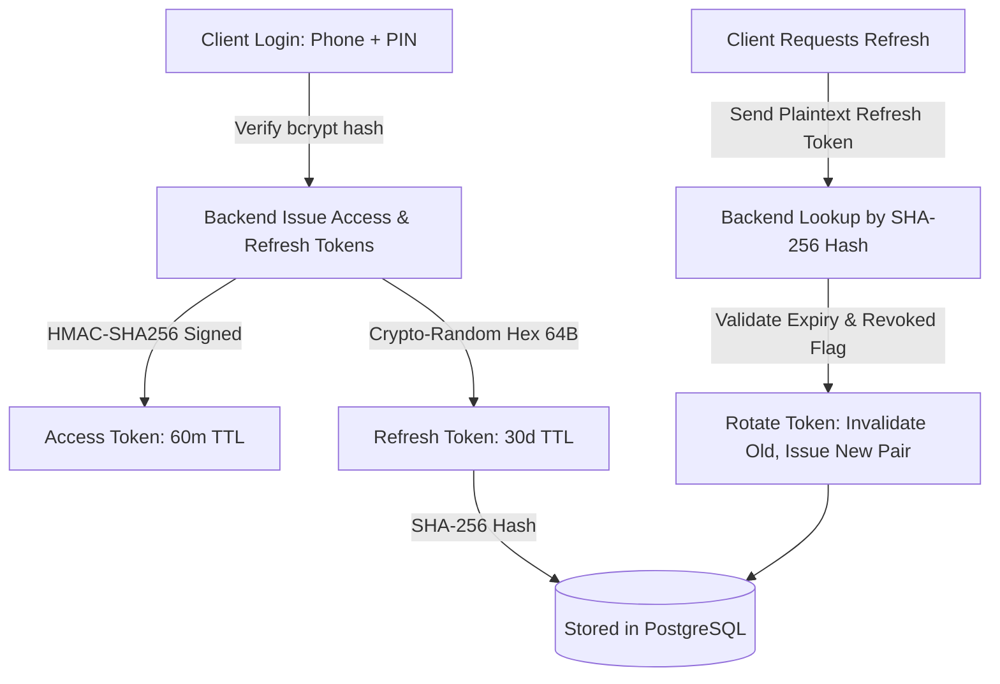

# RenoPay Security Architecture & Threat Model

> **Review Standard**: Amazon Security Bar-Raiser / OWASP ASVS Level 3  
> **Status**: Hardened, Audited, and Regression-Tested  

---

## 1. Threat Model & Mitigations (10 Key Vulnerabilities)

The following matrix documents the specific security threat categories identified during the architectural review and the concrete controls deployed:

| ID | Vulnerability / Threat | Severity | Affected Component | Implemented Mitigation & Verification |
|---|------------------------|----------|--------------------|---------------------------------------|
| `SEC-01` | **Overly Permissive CORS with Credentials** | Critical | `app/main.py` | Replaced wildcard regex with explicit origin allowlist (`https://renopay-u72j.vercel.app`, `capacitor://localhost`, `http://localhost:5173`). Credentials permitted only on explicit origins. |
| `SEC-02` | **Raw Database Exception Leakage** | High | `app/main.py` | Added global exception handler. Uncaught DB errors (`SQLAlchemyError`) now generate a masked UUID `request_id`, logging details internally while returning generic sanitized errors to callers. |
| `SEC-03` | **Distributed Brute Force & Rate Limit Bypass** | High | `app/core/rate_limit.py`, `app/routers/auth.py`, `app/routers/payments.py` | Built sliding-window Redis rate limiters: Auth (15 req/min), Registration (10 req/min), Payments (30 req/min). Integrated in-memory fallback if Redis is unreachable. |
| `SEC-04` | **Clickjacking & Missing Security Headers** | Medium | `nginx.conf`, `app/main.py` | Implemented standard defensive headers: Content-Security-Policy (CSP), `X-Content-Type-Options: nosniff`, `X-Frame-Options: DENY`, `Strict-Transport-Security: max-age=31536000`, and `Referrer-Policy: strict-origin-when-cross-origin`. |
| `SEC-05` | **Unbounded Body Memory Exhaustion (DoS)** | Medium | `app/main.py` | Added streaming request body middleware enforcing a strict **5MB** limit on all incoming JSON and form payloads (`HTTP 413 Payload Too Large`). |
| `SEC-06` | **Insecure / Deprecated JWT Library & Weak Secrets** | High | `app/core/config.py`, `app/core/security.py` | Migrated from unmaintained `python-jose` to `PyJWT 2.9.0`. Startup asserts that `JWT_SECRET` is at least 32 characters long and rejects default placeholder values in non-debug environments. |
| `SEC-07` | **Cross-Tenant WebSocket Broadcast / Data Leak** | Critical | `app/ws/manager.py` | Completely encapsulated WebSocket connection registries. All broadcasts are strictly tenant-isolated (`push(user_id, ...)`). Added Redis pub/sub fanout for horizontal multi-instance scaling. |
| `SEC-08` | **Insecure Direct Object Reference (IDOR)** | Critical | `app/routers/accounting.py`, `app/services/accounting_engine.py`, `app/routers/khatabook.py` | Scoped all Khatabook and General Ledger queries by `merchant_user_id == user.id` and `account_id == user_account.id`. Returning 404 on cross-tenant probes (verified in `tests/test_idor_authorization.py`). |
| `SEC-09` | **Plaintext Refresh Token Compromise** | High | `app/routers/auth.py`, `app/models/auth.py` | Refresh tokens are hashed using SHA-256 before storage (`token_hash_lookup`). Tokens are rotated on every refresh, immediately invalidating the previous session token. |
| `SEC-10` | **Cold-Start DDL Table Creation in Request Path** | Medium | `app/db/session.py` | Removed synchronous `init_db_if_needed()` DDL calls from the per-request dependency injection cycle, eliminating table-lock races and serverless cold-start latency spikes. |

---

## 2. Authentication & JWT Lifecycle

### 2.1 Access Token Specifications
- **Algorithm**: `HS256` (HMAC SHA-256)
- **Issuer / Subject**: User UUID (`sub`)
- **TTL**: 60 minutes
- **Validation**: Strict signature verification, expiry verification, and non-empty subject.

### 2.2 Refresh Token Rotation (RTR)
- Refresh tokens are 64-character cryptographically secure random hexadecimal strings.
- Only the SHA-256 digest of the refresh token is stored in the database.
- Upon each token refresh invocation, the old token is marked `revoked = True` and a new refresh token is issued. Replaying a revoked token triggers an immediate session kill.

---

## 3. Rate Limiting Tiers & Architecture

Rate limits protect against automated enumeration, brute-force PIN cracking, and denial-of-service attempts:

| Route Path | Tier Target | Window | Max Requests | Storage Mechanism | Fallback Behavior |
|------------|-------------|--------|--------------|-------------------|-------------------|
| `/api/v1/auth/register` | Client IP | 60 sec | 10 | Redis Sliding Window | Local Memory Bucket |
| `/api/v1/auth/login` | Client IP | 60 sec | 15 | Redis Sliding Window | Local Memory Bucket |
| `/api/v1/auth/verify-pin` | Client IP + User ID | 60 sec | 15 | Redis Sliding Window | Local Memory Bucket |
| `/api/v1/payments/send` | Client IP + User ID | 60 sec | 30 | Redis Sliding Window | Local Memory Bucket |
| `/api/v1/accounts/me` | User ID | 60 sec | 120 | Redis Sliding Window | Local Memory Bucket |

When Redis is offline, the system seamlessly activates an in-process thread-safe LRU token bucket limiter (`FallbackMemoryLimiter`), ensuring continuous protection.

---

## 4. Role-Based Access Control (RBAC) Matrix

| Resource / Endpoint | Anonymous | Authenticated Consumer | Kirana Shopkeeper | Admin / Auditor |
|---------------------|:---------:|:----------------------:|:-----------------:|:---------------:|
| `POST /auth/login` | ✅ | ❌ | ❌ | ❌ |
| `GET /payments/transactions` | ❌ | ✅ (Own Only) | ✅ (Own Only) | ✅ (Tenant-Scoped) |
| `POST /payments/send` | ❌ | ✅ (With PIN) | ✅ (With PIN) | ❌ |
| `GET /khatabook/customers` | ❌ | ❌ | ✅ (Own Only) | ❌ |
| `POST /accounting/journal` | ❌ | ❌ | ✅ (Own Tenant) | ✅ (Own Tenant) |
| `GET /accounting/trial-balance` | ❌ | ❌ | ✅ (Own Tenant) | ✅ (Own Tenant) |
| `WS /ws` (Real-Time Events) | ❌ | ✅ (Own Events) | ✅ (Own Events) | ❌ |

---

## 5. Secret Rotation & Key Management Plan

1. **JWT Secret (`JWT_SECRET`)**:
   - Rotated every 90 days.
   - Dual-key transition: The verification middleware accepts both current and previous generation keys for a 2-hour grace period to prevent mass user logouts.
2. **Database Credentials**:
   - Neon serverless connection strings configured via AWS Secrets Manager / Vercel Environment Variables.
   - Credentials are never committed to version control (`.gitignore` + automated `gitleaks` pre-commit and CI scans).
3. **Sensitive Field Encryption (`ENCRYPTION_KEY`)**:
   - PII fields (Aadhaar references, PAN hashes) encrypted with AES-128-CBC / Fernet authenticated envelopes.
